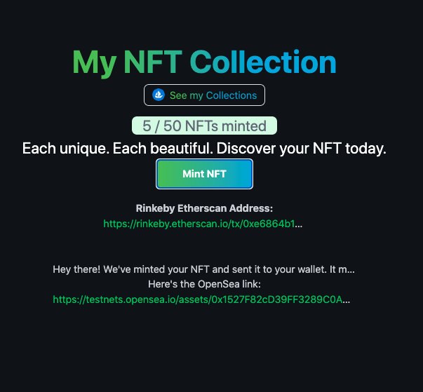

# My EPIC NFT

Epic NFT allows anyone to mint their own NFT programmatically.
The app allows users to connect their Ethereum wallet, and mint an NFT to their wallet so they actually own it. They'll even be able to re-sell the NFT on OpenSea. 

[Live](https://mywave-portal.vercel.app/)



## Getting Started

To get a local copy up and running follow these simple example steps.

### Prerequisites

Make sure Node.js is running on your local machine

### Setup

~~~bash
$ git clone git@github.com:acushlakoncept/epic-nft.git
$ cd epic-nft
~~~

Install modules:

```
yarn add 
```

### Usage

Start server with:

```
  yarn dev
```

# Authors

👤 **Uduak Essien**

- Github: [@acushlakoncept](https://github.com/acushlakoncept/)
- Twitter: [@acushlakoncept](https://twitter.com/acushlakoncept)
- Linkedin: [acushlakoncept](https://www.linkedin.com/in/acushlakoncept/)

## 🤝 Contributing

Contributions, issues and feature requests are welcome!

Feel free to check the [issues page](issues/).

## Show your support

Give a ⭐️ if you like this project!

## Acknowledgments
- [Buildspace](https://app.buildspace.so/)